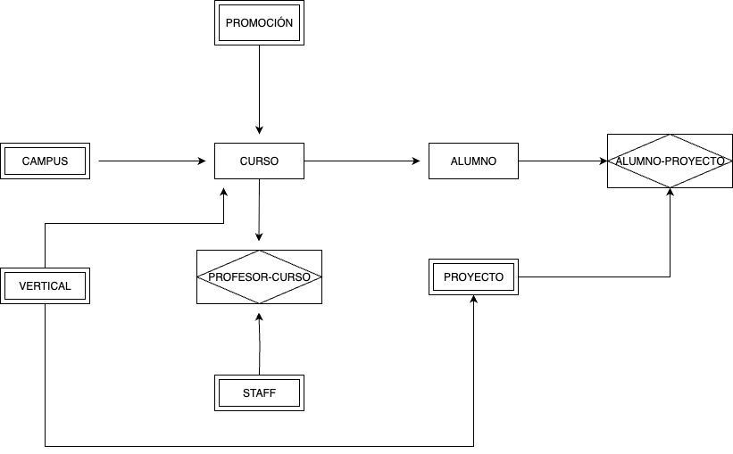
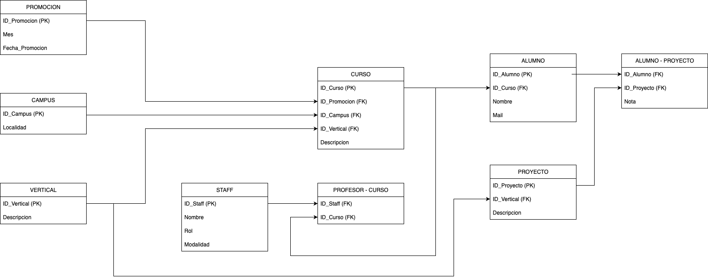

# BaseDeDatosRelacional
Proyecto de Creación de Base de Datos Relacional
# Base de Datos Relacional para Gestión Académica
# Diseño y despliegue de un sistema de base de datos para una escuela de bootcamps
Este proyecto tiene como objetivo el diseño, modelado y despliegue de una base de datos relacional normalizada para la gestión académica de una escuela de bootcamps. A partir de una fuente de datos plana y sin normalizar, se ha construido una arquitectura de datos escalable, normalizada y lista para ser consumida por aplicaciones externas.

## Tecnologías usadas
- **Render**: Hosting de base de datos PostgreSQL en la nube.
- **pgAdmin 4**: Cliente gráfico para administración y consultas.
- **Docker**: Despliegue y pruebas locales en contenedores.
- **Visual Studio Code**: Edición de scripts SQL y documentación.

## Objetivo del proyecto
Diseñar una base de datos relacional a partir de datos no normalizados que describen alumnos, campus, promociones, vertical, staff, profesor_curso, curso, proyecto y alumno_proyecto.
Aplicar técnicas de normalización para asegurar la integridad y evitar redundancia de datos.
Implementar el modelo físico de la base de datos en PostgreSQL y alojarlo en un servidor accesible desde aplicaciones de terceros.
Garantizar la escalabilidad del modelo permitiendo la integración de nuevos campus, promociones, modalidades, aulas, formadores y estudiantes.

## Capturas de pantalla
##Diagrama E/R:

##Diagrama Modelo Lógico base de Datos:

## Repositorio Git del Proyecto
1. Repositorio Git [https://github.com/fernanbga/BaseDeDatosRelacional]

## Lecciones aprendidas
- Modelado eficiente con enfoque en escalabilidad.
- Transformación de datos planos en estructuras normalizadas.
- Implementación de relaciones M:M con tablas intermedias.
- Configuración de Render y despliegue en entorno productivo.
- Testing local mediante Docker y pgAdmin.

## Funcionalidades futuras
- Integración con interfaz frontend (dashboard).
- Control de usuarios y permisos.
- Soporte multilingüe y para zonas horarias.
- Automatización de carga desde CSV o formularios web.

## Autores
- Nombres: 
- Gilberto Gregorio Figueira Santamaria 
- Jerome Juan
- Mercedes Cuesta
- Pedro López Fontaneda
- Fernán Burgos

